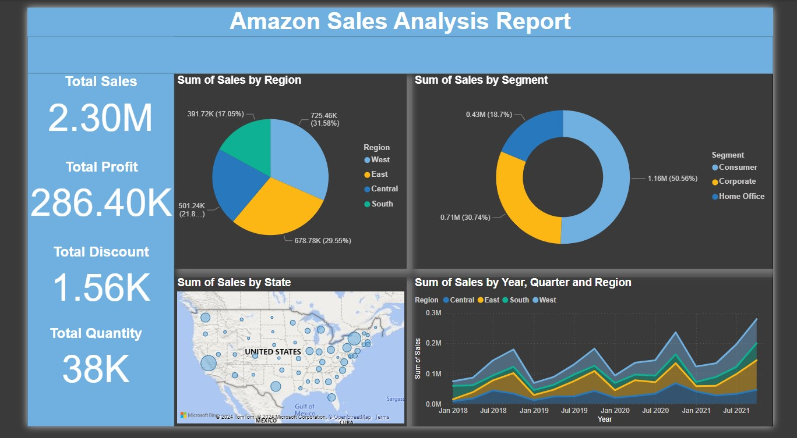

# Sales Report Power-BI

##
🔎 Project Overview

This project presents an Amazon Sales Analysis Report built using Power BI.
The dashboard provides interactive insights into sales performance across multiple dimensions such as region, segment, state, and time. It is designed to help stakeholders quickly identify trends, profit drivers, and opportunities for improvement.

📂 Dataset

Source: Amazon Sales dataset (sample/synthetic data for analysis purposes)

Records Included: Sales transactions with fields such as sales, profit, discount, quantity, region, segment, and state

📈 Key Insights from the Dashboard

Total Sales: 2.30M

Total Profit: 286.40K

Total Discount: 1.56K

Total Quantity Sold: 38K

Breakdown of Analysis

Sales by Region

West leads with the highest sales (31.58%), followed by East (29.55%), Central (21.82%), and South (17.05%).

Sales by Segment

Consumer segment contributes the largest share (50.56%), followed by Corporate (30.74%) and Home Office (18.7%).

Sales by State (Geographic Analysis)

A map visualization highlights state-level sales distribution, showing stronger sales in key metropolitan areas.

Sales Trend by Year, Quarter, and Region

Sales have shown consistent growth from 2018 to 2021, with visible seasonal spikes and regional variations.

🛠 Tools & Technologies

Power BI: Data modeling, DAX, interactive dashboard creation

Excel/CSV: Raw dataset preparation and cleaning

Visualization Techniques: Pie charts, line charts, maps, and KPIs

🚀 Outcomes

Built an end-to-end sales performance dashboard

Enabled data-driven decision-making by providing insights into regional and segment-wise sales trends

Highlighted key growth opportunities and areas for operational improvements

## 

